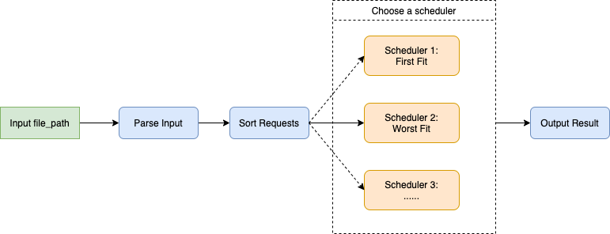

## Movie Theater Seating Challenge - 2020

Language used: Python

### Goal

Design and write a seat assignment program to maximize both customer satisfication and customer safety.

### Hard Constraints

1. To ensure maximum customer safety we take a buffer of three seats or one row

### Assumptions

1. Back-row seats are preferable to front-row seats

   - Reservations with top priority will have the seats farthest from the screen for better visibility 

2. The customers don't mind about how close they are to the center

   - Customers have to be placed the edges first to reduce the amount of buffer seats.

3. The customers are not willing to be placed separately

   - Only when it is not possible and customers agree to split,  then we process it as two seperate requests

### WorkFlow

### Algorithm

The stratrgy to choose which group of customers and which row.

#### 1. First come, first serve + FirstFit

- **Customers**: The requests are processed in the same order as which they have arrived i.e. on first come first serve basis.Groups earliest in the reservation list get the better rows.

- **Row**: Find the furthest row which could satisfy their seat demand for each request.

#### 2. Largest customer serve first + WorstFit

- **Customers**: Because of the public safety policy, a buffer of three sears or one row is requested. For better theater space utilization, we could always satisfy customers with largest group size.

- **Row**: Find the emptiest row to store group of customers(Use heap to implement).

### Execution Instructions

#### Execution

- Run: `python main.py [input-file-path] [FirstFit|WorstFit(Default)]`

#### Batch Execution

- Run: `python test_driver.py [FirstFit|WorstFit(Default)]` 

### Future plans

1. Support seperately place group of customers
2. Add more scheduler methods
3. Dynamically adopt different scheduler methods according to size and distribution of requests
4. Implement backtracking to ensure optimal fit